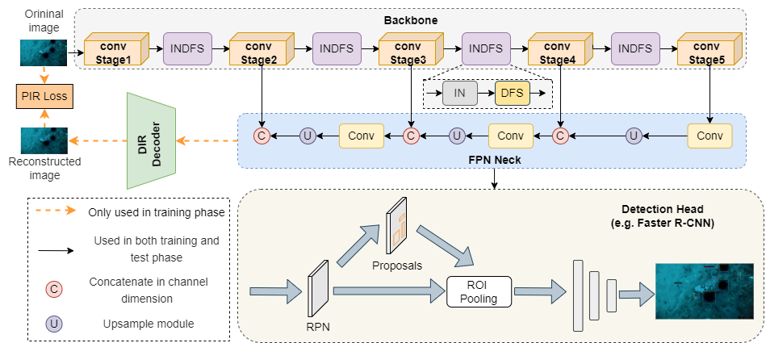

<h1> Self-Supervised Domain Feature Mining for Underwater Domain
Generalization Object Detection </h1>

## 👀Introduction

This repository contains the code for our paper `Self-Supervised Domain Feature Mining for Underwater Domain
Generalization Object Detection`.

In the practical application of underwater object detection, the object detection network is generally trained on known source domains and applied to the field scene of the unknown domain, which can be regarded as a domain generalization object detection task. However, owing to the disparities between the source domain and unknown domain data, the object detection network often suffers from a domain shift phenomenon during migration to the unknown domain, resulting in compromised generalization capabilities of the underwater object detection network. To address this challenge, this paper proposes a general underwater generalized object detection framework termed as SPIR-DFM. SPIR-DFM extracts domain-invariant features and task-relevant domain-specific features through deep feature mining, thereby enhancing the generalization capability of the underwater object detection network in the target domain. Firstly, the Instance Normalization and Domain Feature Supplement(INDFS) module is designed. Within the INDFS, the Instance Normalization(IN) module mitigates style variations across domains through instance-level normalization, enabling the extraction of domain-invariant features from the source domain, and the Domain Feature Supplement(DFS) module explicitly captures the task-related domain-specific features lost in the normalization process through the idea of feature decomposition to increase the discriminative power of the model. Additionally, a Domain Information Reconstruction (DIR) decoder is designed to reconstruct the principal information of the source domain using the multi-scale features extracted by the object detector. The Principal Information Reconstruction(PIR) loss between the reconstructed domain and the original source domain information is designed to serve as a weak regularization term, guiding the process of deep feature mining in a self-supervised learning manner. The extensive comparison and visualization experiments on the underwater domain generalization dataset S-UODAC2020 demonstrate the effectiveness of our method.

## 💡Environment

We test our codebase with `PyTorch 1.10.0 + CUDA 11.3 + MMdetection2.25.1`. Please install corresponding PyTorch and CUDA versions according to your computational resources.

## ⏳Setup

### Datasets
The S-UODAC2020 dataset can be downloaded from -[This link](https://github.com/mousecpn/DMC-Domain-Generalization-for-Underwater-Object-Detection)

### Training

    $ python tools/train.py configs/spir_faster.py

### Evaluation
Run the evaluation by:

    $ python tools/test.py configs/spir_faster.py <path/to/checkpoints>

We will provide our Training weight at this link:

## 🙏Acknowledgements

Ou codes are based on [mmdetection](https://github.com/open-mmlab/mmdetection).
We also appreciate DMC(https://github.com/mousecpn/DMC-Domain-Generalization-for-Underwater-Object-Detection) for providing their processed datasets.

